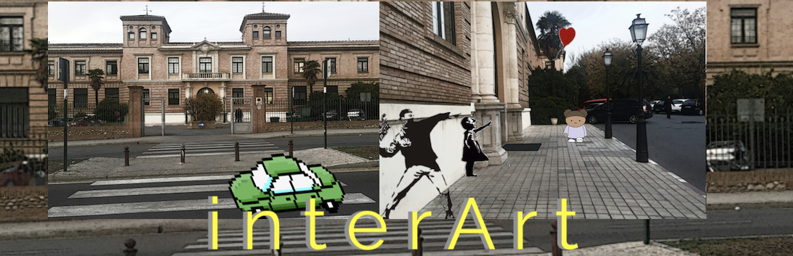

# interArt

Digital Interactive art / Muestra colectiva de arte interactivo 

Muestra de trabajos de Creación Multimedia Interactiva 

Facultad de Bellas Artes, Universidad de Granada

## La muestra

- [Obras seleccionadas 2018](./2018/readme.md)
- [Ejemplo de proyecto en github.io](http://mgea.github.io/cmi) clonando este repositorio (http://github.com/mgea/cmi) 
- [Ficha plantilla de proyecto](./Plantilla_proyecto.md)

## Acerca de este proyecto:

Febrero 2019 

[Creacion Multimedia Interactiva](http://utopolis.ugr.es/cmi)

[Facultad de Bellas Artes](http://bellasartes.ugr.es)

Universidad de Granada

