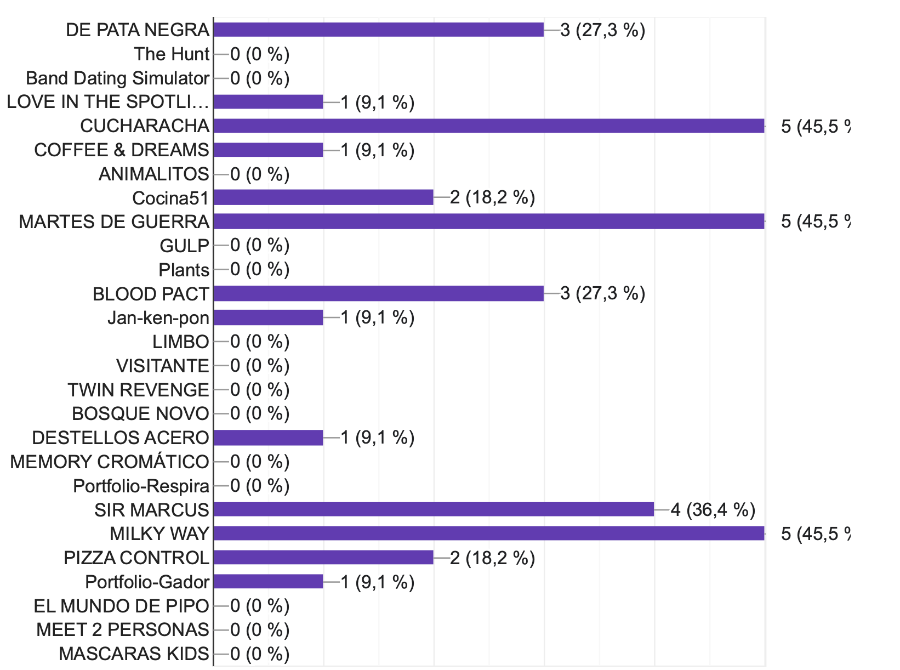

## interArt 2025

Muestra de trabajos del espacio digital interactivo 2024/25 Trabajos seleccionados

 

Enlace a folio de evaluacion: https://forms.gle/G1dn4rjvGFga3ZhP6

 

### DE PATA NEGRA  (Alba Callejón) ⭐ 
  
  https://alt-alba.itch.io/de-pata-negra
  
  :octocat: https://github.com/alt-alba/cmi

| Nombre                           | Titulo                          | Github                                         | [Itch.io](http://itch.io/)                                |
| -------------------------------- | ------------------------------- | ---------------------------------------------- | --------------------------------------------------------- |
| CALLEJON JAREÑO, ALBA            | DE PATA NEGRA                   |                                                |                                                           |
| CALVO MOLINA, ALBA MARIA         | The Hunt                        |                                                |                                                           |
| DIAZ GARCIA, PAOLA               | Band Dating Simulator           |                                                |                                                           |
| FERNANDEZ LABANDER FIRAT, DERIN  | LOVE IN THE SPOTLIGHT           | https://github.com/yildizcreature/cmi          | https://yildizcreature.itch.io/love-in-the-spotlight      |
| GARZON RUIZ, LEO                 | CUCHARACHA                      | https://github.com/LeoGarru                    | https://leogarru.itch.io/                                 |
| GOMEZ MARTINEZ, MACARENA         | COFFEE & DREAMS                 | https://github.com/macarenagm05/cmi            | https://macarenagm05.itch.io/coffee-dreams                |
| GOMEZ MUÑOZ, ANGELA              | ANIMALITOS                      | https://github.com/angelagomuz/cmi             |                                                           |
| GONZALEZ RUIZ, ISABEL            | Cocina51                        | https://github.com/8darov/Martes               |                                                           |
| GONZALEZ TORRES, ALBA            | MARTES DE GUERRA                | https://github.com/8darov/cmi                  | https://8darov.itch.io/martes                                               |
| HERNANDEZ GARCIA, LUCIA          | GULP                            |                                                |                                                           |
| JIMENEZ MARTIN, FRANCISCO ERIK   | Plants                          | https://github.com/Elgordolo/plant-s           | https://elgorlodo.itch.io/plants                          |
| JIMENEZ ROJAS, IGNACIO           | Portfolio                       |                                                |                                                           |
| JIMENEZ VARGAS, INES             | BLOOD PACT                      | https://github.com/Sara-hedgehog/cmi           | https://sara-hedgehog.itch.io/bloodpact                   |
| LEON CANELO, MACARENA ISABEL     | Jan-ken-pon                     | https://github.com/LeonMIC                     | https://m-ilc.itch.io/yan-ken-pon                         |
| LOPEZ TELYUBAEVA, PATRICIA LUCIA | LIMBO                           |                                                |                                                           |
| MALDONADO GOMEZ, JOSE ANTONIO    | LAS DOS TORRES VISITANTE        |                                                |                                                           |
| MARTIN SANCHEZ, ALBA             | TWIN REVENGE                    |                                                |                                                           |
| MARTINEZ RODRIGUEZ, MARIA        | Entre Raices  (BOSQUE NOVO)     |                                                |                                                           |
| MILLAN CRUZ, GEMMA               | DESTELLOS ACERO                 |                                                | https://itch.io/profile/gemmitta                          |
| MORA GARCIA, CLAUDIA             | MEMORY CROMÁTICO                |    https://github.com/clau8-mora/cmi     | https://clau8-mora.itch.io/memory-cromtico-invertido                                               |
| MORELLO , LUNA                   | Portfolio-Respira               | https://github.com/lunamorello/cmi             |                                                           |
| ORTIZ SALINAS, ANGEL LUIS        | SIR MARCUS                      | https://github.com/newmesis/Sir-Marcus         | https://gameofnewmesis.itch.io/sirmarcus                  |
| PEREZ JIMENEZ, CARMEN            | MILKY WAY                       | https://github.com/CarmenPJ185/cmi/            | https://possummind.itch.io/milky-way                      |
| RUIZ ESCOBAR, ANA                | PIZZA CONTROL                   |                                                |                                                           |
| SALMERON FERNANDEZ, GADOR        | Portfolio                       |                                                |                                                           |
| SANCHEZ ARANDA, DANA SOFIA       | EL MUNDO DE PIPO                |                                                | https://dana-sofia.itch.io/la-aventura-de-pipo2           |
| SOLIS PEREZ, OLGA                | MEET 2 PERSONAS                 |                                                |                                                           |
| TORO COSTALES, DANIEL            | MASCARAS KIDS                   | https://github.com/DanielToro90/Mascaras-kidzs |                                                           |

Resultados Test del 29 / 5 / 2025

