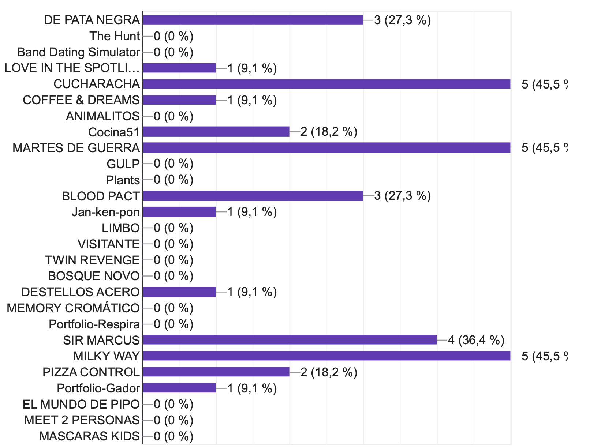

## interArt 2026

Muestra de trabajos del espacio digital interactivo 2025/26 Trabajos seleccionados

Este año **TODOS los proyectos han sido desarrollados con Godot Engine 4.6** (2ª edicion con Godot)  https://godotengine.org/

Se ha subido una versión jugable :video_game: online en HTML a [itch.io](https://itch.io/)

La documentación y temporización se puede encontrar en https://github.com/mgea/godot

 

 

| n    | Autor/a                       | Título                                    | Github                                              | Itch.io                                                      | INfo     | ⭐     |
| ---- | ----------------------------- | ----------------------------------------- | --------------------------------------------------- | ------------------------------------------------------------ | -------- | ----- |
| 1    | AGUDO TAPIA, TANIA MARIA      | VESTIR NIÑAS                              |                                                     | https://russkitos-987.itch.io/juego                          |          | Falla |
| 3    | BAENA ALAMINOS, MARIA EUGENIA | CASA TERROR                               |                                                     | https://eugeniabaenalaminos.itch.io/casa-del-terror          |          |       |
| 4    | BLANCO QUESADA, SALVADOR      | AMARGA NAVIDAD                            |                                                     | https://esalvablancogougres.itch.io/la-visin                 |          |       |
| 5    | CEACERO CARRASCO, CLAUDIA     | ZOMBIES VAQUEROS                          |                                                     |                                                              |          |       |
| 6    | CENDEJAS FRANK, RENEE         | PORTFOLIO                                 | [enlace](https://github.com/reneefrank07-cpu/portfolio-arte)  |                                                              |          |       |
| 7    | CRESPI SANZ, JULIA            | PORTFOLIO ART QUIZ                        |                                                     | ??                                                           |          |       |
| 9    | GARCIA MARRUECOS, LUCIA       | PORTFOLIO                                 | [enlace](https://github.com/1l1ucia/portfolio)                | https://1l1ucia.itch.io/portafolio                           |          |       |
| 10   | GARCIA MORENO, ERIKA          | TOSTADORA                                 | [enlace](https://github.com/escalerilla/tostadoralafuga)      | https://erigarcmo.itch.io/demo-p2-tostador-a-la-fuga         |          |       |
| 11   | GARCIA ROBLES, IRENE          | ADAI                                      | [enlace](https://github.com/Aidennx95/ADAY)                   | https://aidennx95.itch.io/aday                               |          |       |
| 12   | GONSAGA MATOS, JOYCIANE       | PORTFOLIO                                 |                                                     | https://gonsagamatosjoy-creator.itch.io/portfoliojoycianegonsaga |          |       |
| 14   | LAGO YNOLOPU, **KARIM**       | PORTFOLIO                                 |                                                     | https://kyx1000.itch.io/portfoliointeractivo                 |          |       |
| 15   | LICARI CASTELAR, KIARA        | JUMPING FROG                              |                                                     | https://kiaralc57.itch.io/jumping-frog                       |          |       |
| 16   | LUQUE GOMEZ, MARCO            | CABALLA STABLE                            | [enlace](https://github.com/raypika/caballastable)            |                                                              |          |       |
| 17   | MALLOL GARCIA, ANNA           | PINGUIN ISOM                              | [enlace](https://github.com/annamallol/la-classe-dels-pingus) | https://annamallol.itch.io/la-classe-dels-pinguins           | RPG Isom |       |
| 18   | MARTIN VILCHEZ, SABRINA       | DAUGHTER OF CAIN  (vestir personajes)     | [enlace](https://github.com/Sabromv/daughtersofcain)          |                                                              |          |       |
| 19   | MARTINEZ BALLESTEROS, JULIA   | HAMBRE Y SACRIFICIO (escaperoom vampiros) | [enlace](https://github.com/JMarBall/Hambre-y-Sacrificio)     | https://julia7mb.itch.io/hambre-y-sacrificio                 | Dialogic |       |
| 20   | MARTINEZ RIVAS, ARIADNA       | LOS OBJETOS PERDIDOS                      | [enlace](https://github.com/Minaro00/Perdidos)                | https://minaro00.itch.io/los-objetos-perdidos                | RPG      |       |
| 21   | MORALES SANCHEZ, MIRIAM       | EL MUNDO DE PEPO                          | [enlace](https://github.com/Miriammoraless/ElMundoDePepo)     | https://miriammmm.itch.io/el-mundo-de-pepo                   | RPG      |       |
| 22   | MORENO MELGUIZO, LUNA         | gato medieval                             | [enlace](https://github.com/Lumomel/GatosMedievales)          |                                                              |          |       |
| 23   | PORCEL HIDALGO, LOGAN         | taxidermia                                | [enlace](https://github.com/browmbie/taxidermia)              |                                                              |          |       |
| 24   | ROCHA CAMPILLO, ALBERTO       | Z-GRANNY                                  | [enlace](https://github.com/alroxa/Z-GRANNY)                  | https://albert0r0cha.itch.io/z-granny                        |          |       |
| 25   | RUIZ PARRAS, BEATRIZ          | LUMI - JARDIN DE ANIMALES                 |                                                     | https://beatrizruizp97.itch.io/lumi-y-el-jardin-laberinto    |          |       |
| 26   | SANCHEZ GARCIA, ERIKA         | LIMPIA PORFI 2                            | [enlace](https://github.com/erikasg16/cmi)                    | https://erikasg161correougres.itch.io/limpia-porfi-2         |          |       |
| 27   | SANCHEZ LOPEZ, JULIA          | mirror_of_contempt                        |                                                     | https://gyalia.itch.io/mirror-of-contempt-wip                |          |       |
| 28   | SERRANO TIRADO, MERCEDES      | CAELI                                     | [enlace](https://github.com/M3chaxs/caeli)                    | https://mechaxs-3.itch.io/caelisadventure                    |          |       |
| 29   | URBANO SANCHEZ, LIDIA         | Atrapa al Fantasma                        | [enlace](https://github.com/LilyusArt/Atrapa-al-Fantasma)     | https://itch.io/game/edit/4547863                            |          |       |
| 30   | ZORRILLA LARA, ELENA          | EL BOSQUE                                 | [enlace](https://github.com/Elenanilllo/El-bosquete)          | https://elenanillo26.itch.io/el-bosquete                     |          |       |

| Autor                            | Título                    |  ⭐  | :octocat:   Github                                       | [ :video_game: ](https://itch.io/)                                |  Interactivo       |
| -------------------------------- | --------------------------| ---- | ---------------------------------------------- | --------------------------------------------------------- | ------  |
| CALLEJON JAREÑO, ALBA            | DE PATA NEGRA             |      |                                                |                                                           | Dialogic|
| CALVO MOLINA, ALBA MARIA         | The Hunt                  |  [ :octocat: doc ](https://github.com/Va-lan-art/THE-HUNT/)    |   https://va-lan.itch.io/the-hunt                                             |                                                           | Dialogic |
| DIAZ GARCIA, PAOLA               | Band Dating Simulator     |      |                                                                             |                                                           | Dialogic|
| FERNANDEZ LABANDER FIRAT, DERIN  | LOVE IN THE SPOTLIGHT     |⭐⭐  | [ :octocat: doc ](https://github.com/yildizcreature/Love-in-the-Spotlight)  | [link](https://yildizcreature.itch.io/love-in-the-spotlight)      | |
| GARZON RUIZ, LEO                 | CUCHARACHA                |⭐⭐⭐| [ :octocat: doc ](https://github.com/LeoGarru)                              | [link](https://leogarru.itch.io/)                      |Dialogic, D&D |
| GOMEZ MARTINEZ, MACARENA         | COFFEE & DREAMS           |      | [ :octocat: src ](https://github.com/macarenagm05/cmi)                      | [link](https://macarenagm05.itch.io/coffee-dreams)    | | 
| GOMEZ MUÑOZ, ANGELA              | ANIMALITOS                |      | [ :octocat: src ](https://github.com/angelagomuz/cmi)             |                                                           | Quizz|
| GONZALEZ RUIZ, ISABEL            | Cocina51                  |      | [ :octocat: src ](https://github.com/8darov/Martes)               |                                                           | |
| GONZALEZ TORRES, ALBA            | MARTES DE GUERRA          |⭐⭐⭐| [ :octocat: src ](https://github.com/8darov/cmi)                  | [link](https://8darov.itch.io/martes)               | Dialogic, snake |
| HERNANDEZ GARCIA, LUCIA          | GULP                      | | [Gulp](https://github.com/LuciHG/cmi)     | https://lucyinthesky-224.itch.io/gulp                                                                                          ||
| JIMENEZ MARTIN, FRANCISCO ERIK   | Plants                    |      | [ :octocat: src ](https://github.com/Elgordolo/plant-s)           | [link](https://elgorlodo.itch.io/plants)               | |
| JIMENEZ ROJAS, IGNACIO           | Portfolio                 |      |                                                |                                                           ||
| JIMENEZ VARGAS, INES             | BLOOD PACT                |      | [ :octocat: src ](https://github.com/Sara-hedgehog/cmi)           | [link](https://sara-hedgehog.itch.io/bloodpact)              ||
| LEON CANELO, MACARENA ISABEL     | Jan-ken-pon               |      | [ :octocat: src ](https://github.com/LeonMIC)                     | [link](https://m-ilc.itch.io/yan-ken-pon)            ||
| LOPEZ TELYUBAEVA, PATRICIA LUCIA | LIMBO                     |      |                                                |                                                           ||
| MALDONADO GOMEZ, JOSE ANTONIO    | LAS DOS TORRES VISITANTE  |      |                                                |                                                           ||
| MARTIN SANCHEZ, ALBA             | TWIN REVENGE              |     |                                                |                                                           ||
| MARTINEZ RODRIGUEZ, MARIA        | Entre Raices  (BOSQUE NOVO) |    |                                                |                                                           ||
| MILLAN CRUZ, GEMMA               | DESTELLOS ACERO            |     |                                                | [link](https://itch.io/profile/gemmitta)                          ||
| MORA GARCIA, CLAUDIA             | MEMORY CROMÁTICO           |     | [ :octocat: src ]( https://github.com/clau8-mora/cmi)     | [link](https://clau8-mora.itch.io/memory-cromtico-invertido)           | |
| MORELLO , LUNA                   | Portfolio-Respira          |     | [ :octocat: src ](https://github.com/lunamorello/cmi)             |                                                           | |
| ORTIZ SALINAS, ANGEL LUIS        | SIR MARCUS                 |     | [ :octocat: src ](https://github.com/newmesis/Sir-Marcus)     | [link](https://gameofnewmesis.itch.io/sirmarcus)                  | |
| PEREZ JIMENEZ, CARMEN            | MILKY WAY                  |     | [ :octocat: src ](https://github.com/CarmenPJ185/cmi/)        | [link](https://possummind.itch.io/milky-way)                      ||
| RUIZ ESCOBAR, ANA                | PIZZA CONTROL              |     |                                                |                                                           ||
| SALMERON FERNANDEZ, GADOR        | Portfolio                  |     |                                                |                                                           ||
| SANCHEZ ARANDA, DANA SOFIA       | EL MUNDO DE PIPO           |     |                                                | [link](https://dana-sofia.itch.io/la-aventura-de-pipo2)           ||
| SOLIS PEREZ, OLGA                | MEET 2 PERSONAS            |     |                                                |                                                           ||
| TORO COSTALES, DANIEL            | MASCARAS KIDS              |     | [ :octocat: src ](https://github.com/DanielToro90/Mascaras-kidzs) |                                                           ||

Enlace a folio de evaluacion: https://forms.gle/G1dn4rjvGFga3ZhP6

Resultados Test del 29 / 5 / 2025

-------------
Creación Multimedia Interactiva, mayo 2025

Facultad de Bellas Artes, Universidad de Granada

CCBYNCSA M. Gea

